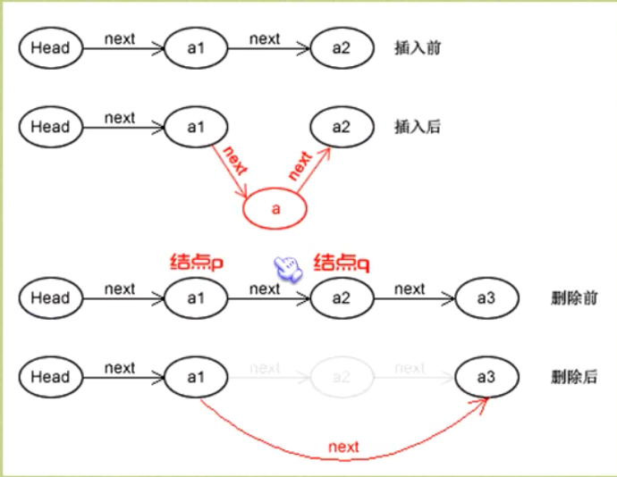

# 链表和数组区别

## 链表
- 读取时从第一个开始读取，找到下一个的地址，并for循环找到第i个的地址，并读取值。时间复杂度为`O(n)`
- 插入时循环找到第i个元素，然后将第`i - 1`和第`i + 1`的地址指向需插入的地址即可。查找时间复杂度为`O(n)`
- 删除时循环找到第i个元素，然后将第`i - 1`的位置指向第`i + 1`的位置即可，查找的时间复杂度为`O(n)`
- 删除整表：声明节点p、q，将第一个节点赋值给p，下一节点赋值给q，循环执行释放p和将q赋值给p的操作
    - 此处为什么需要两个变量，因为free(p)之后，需要将q来记录下一个节点的位置
- 

## 数组
- 读取时直接找到第i个元素，然后读取出来。时间复杂度为`O(1)`
- 插入时找到第i个元素，然后将第`i + 1`之后的元素都往后移动一个位置，移动的时间复杂度为`O(n)`
- 删除是也是找到第i个元素，然后将i移除数组，之后将后续的数组逐个前移

## 区别
- 插入和删除： 相对于来说时间复杂度都是一样的，但是相对于插入和删除操作频繁的操作来说，链表的效率优势会越明显(因为链表仅需第一次查找之后已经知道具体位置，然后插入到具体位置即可，但是数组需要频繁移动后面元素的位置)
- 数组需要动态分配长度，链表无需分配且无限制长度