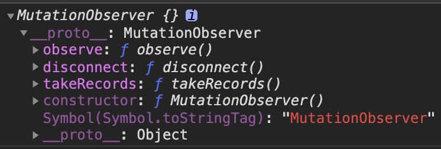
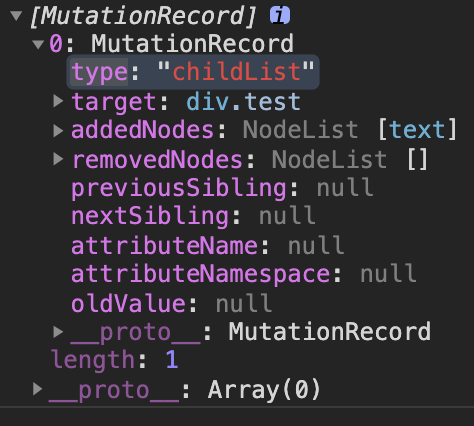

# MutationObserver Api

## MutationObserver Api

- 提供了监听Dom树变化的能力，设计初衷是为了替代[Mutation Events功能](./MutationEvents.md)，该功能也是Dom3 Events的一部分

- `MutationObserver()`创建一个新的MutationObserver，在指定的dom变化时被调用

- 包含三个方法(mdn)
    - `disconnect()`: 阻止`MutationObserver`实例继续接收通知
    - `observe()`: 配置`MutationObserver`在DOM更改匹配给定选项时，通过其回调函数开始接收通知。
        - childList: 监听子元素的变化
        - attributes: 属性的变化
        - characterData: 节点内容或文本变化
        - subtree: 所有子元素、子元素的子元素的变化
        - attributeOldValue: 记录变化前的属性
        - characterDataOldValue: 记录变化前的数据值
        - attributesFilter: 需要观察的特定属性
    - `takeRecords()`: 从`MutationObserver`的通知队列中删除所有待处理的通知，并将它们返回到`MutationRecord`对象的新队列中。
    - ;

## 使用方法
- `var observer = new MutationObserver(callback)`构建实例，并指定callback
    - type
        - attribute
        - characterData
        - childList
    - target
    - addedNodes
    - oldValue
    - childList
    - ;
- `observer.observer(dom, options)`指定dom节点，以及监听的属性
- 

## 与`Mutation Events`区别
- 优点
    - 等待所有脚本任务完成后才会运行，即一部触发
    - 把dom变动封装成一个数组进行处理，而不是一条条处理dom变动
- 缺点
    - 对input、textarea不生效

## [例子](./test.html)