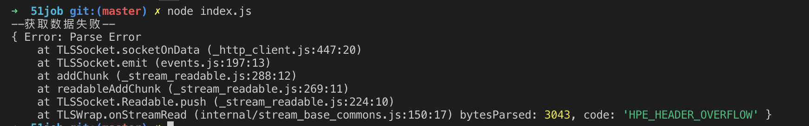
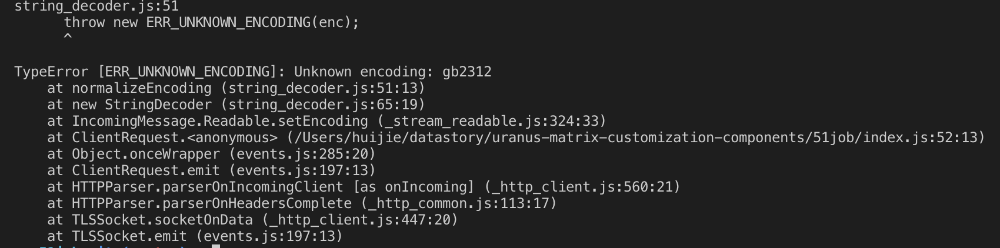

# nodejs爬取51job

## http & https

## 报错 HPE_HEADER_OVERFLOW

- ;

- 解决方案shell`node --max-http-header-size=80000 index.js`

## 编码错误 ERR_UNKNOWN_ENCODING

- ;

- `.setEncoding('gb2312')`设置会报错，因为没有当前这个编码格式

- 添加`iconv-lite`，并进行设置

- cheerio.load需添加参数`decodeEntities: false`

- 基本代码如下
``` JavaScript
    // http 返回值
    res.setEncoding('binary');

    let html = '';
    // 拼接返回数据
    res.on('data',function(data){
        html += data;
    });
    
    res.on('end',function(){
        let buf = new Buffer(html,'binary');
        let str = iconv.decode(buf, 'GB2312'); // 此处设置编码

        let $ = cheerio.load(html, { decodeEntities: false }); // 
    });
```